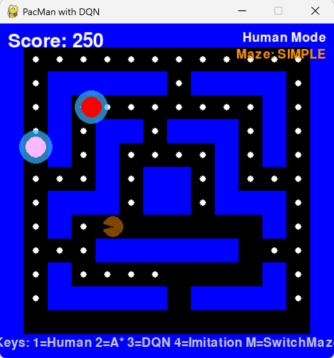
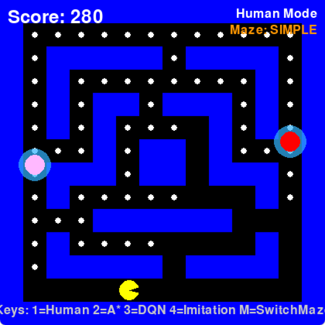
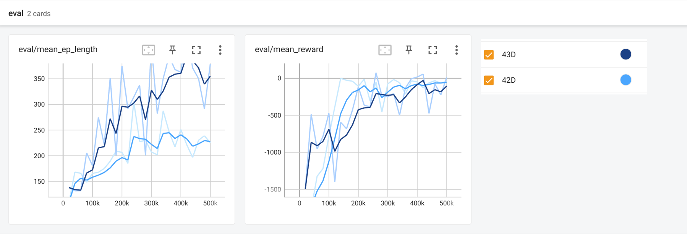
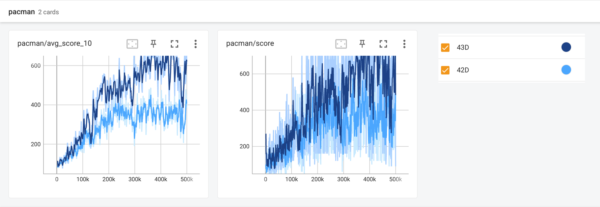

# PACMAN-RL-VS-BC (Extended Version)

<<<<<<< HEAD
A Pacman game implementation that compares **Reinforcement Learning (DQN)** with **Behavioural Cloning (Imitation Learning)** approaches for game AI.
=======
A Pacman game implementation that compares Reinforcement Learning (DQN) with Behavioural Cloning (Imitation Learning) approaches for game AI.  

> 🧩 **Original project by [Jmansford](https://github.com/jmansford)**  
> 🔧 **Extended and modified by Team Members: Yi Yang, Kaiyue Yang, and Chenle Wang**  
>  
> On top of the original codebase, we added three new gameplay mechanics — **Accelerate**, **Freeze**, and **Invisible** — and completed **reinforcement learning (RL) training** experiments for the DQN agent.
>>>>>>> a9a7c654fa6724409636fc442f499dfb0a10b4e1

This repository is **an extended version based on the original project by [Jmansford](https://github.com/Jmansford/Pacman-RL-VS-BC)**, with additional features and innovations developed as part of a **team project** by  
**Yi Yang, Kaiyue Yang, and Chenle Wang** at **Technische Universität Dresden**.
- 
---

<<<<<<< HEAD
## 🧠 Project Overview

This project implements a Pacman game environment where the player (Pacman) can be controlled by either:
1. A **Deep Q-Network (DQN)** trained through reinforcement learning
2. A **Behavioural Cloning** model trained through imitation learning
=======
---

## Project Overview

This project builds upon Jmansford’s original Pacman RL framework and extends it with additional features and experiments.  
It provides an environment where Pacman can be controlled by:
>>>>>>> a9a7c654fa6724409636fc442f499dfb0a10b4e1

1. A **Deep Q-Network (DQN)** trained through reinforcement learning  
2. A **Behavioural Cloning** model trained through imitation learning  
3. Extended gameplay functions to test advanced AI adaptability

<<<<<<< HEAD
In our **extended version**, we introduced **three new gameplay abilities** and expanded the **state observation dimension** from **42 → 43**, enabling the agent to learn **skill-aware decision making**.

---
=======
The goal is to compare the performance, learning efficiency, and behavior of these two AI approaches under enhanced game dynamics.

---

## New Features Added by Our Team

- **Accelerate Mode** – Pacman can temporarily move faster.
- 
- **Freeze Mode** – Freezes ghosts for a short duration.
- 
- **Invisible Mode** – Makes Pacman invisible to ghosts temporarily.
- 
- Completed **Reinforcement Learning (RL) training** and evaluation for DQN agents under these new mechanics.

---

## Original Features (from Jmansford)

- Classic Pacman gameplay with ghosts and pellets  
- Two different maze configurations (Simple and Complex)  
- DQN-based reinforcement learning implementation  
- Behavioural Cloning through imitation learning  
- Expert demonstration recording and playback  
- Automated testing framework  
- Enhanced feature extraction for better learning  
- Visual rendering of the game state  

---
>>>>>>> a9a7c654fa6724409636fc442f499dfb0a10b4e1

## 🚀 New Features (Developed by Yi Yang, Kaiyue Yang, and Chenle Wang)

### 🟢 Added Power-Ups
We introduced three new gameplay abilities that can be triggered and tracked by the AI:
1. **Boost** – temporarily increases Pacman’s speed  
- 
2. **Invisibility** – makes Pacman invisible to ghosts for a short duration
- 
3. **Freeze** – freezes all ghosts temporarily  
- 

### 🧩 State Space Expansion (42D → 43D)

To allow the RL agent to perceive its current skill status, we added a new **Pacman status feature vector**:

```python
pacman_status_features = np.array([
    is_boosted, boost_timer_normalized,
    is_invisible, invisible_timer_normalized,
    is_freezing, freeze_timer_normalized
], dtype=np.float32)
```

These new 6 status features are concatenated with the original 42-dimensional observation, forming a **43-dimensional** total state vector:

```python
full_observation = np.concatenate([
    pacman_status_features,
    base_observation,
    enhanced_features
])
```

| Version     | State Dimensions | Skill State Features | Skill State Awareness | Behavioral Intelligence Improvement |
|--------------|------------------|----------------------|------------------------|--------------------------------------|
| Old 42-dim   | 42               | None                 | No                     | Cannot distinguish normal/boost/invisible states |
| New 43-dim   | 43               | 6 skill state features | Yes                   | Can intelligently use all skills |

---

## 📈 Evaluation

During DQN training, the **43D model** shows higher average reward and faster convergence compared to the **42D baseline**.

<div align="center">
  
  
</div>

*Comparison of average scores over 500k timesteps (Dark Blue: 43D, Light Blue: 42D)*

The extended state dimension enables the RL agent to:
- Recognize and utilize power-up states effectively  
- Show adaptive behavior (e.g., using invisibility when surrounded by ghosts)  
- Achieve higher cumulative rewards  

---

## 🕹️ Classic Features (from Original Project)

- Classic Pacman gameplay with ghosts and pellets  
- Two maze configurations: **Simple** and **Complex**  
- DQN-based Reinforcement Learning and Imitation Learning agents  
- Expert demonstration recording and playback  
- Enhanced feature extraction for better state representation  
- TensorBoard integration for training visualization  

---

## 🎮 Controls

### Game Modes
<<<<<<< HEAD
- `1`: HUMAN mode (manual control)  
- `2`: A_STAR mode (automatic pathfinding)  
- `3`: DQN mode (reinforcement learning)  
- `4`: IMITATION mode (behavioural cloning)  

### Human Mode Controls
- `↑ ↓ ← →`: Move directions  

### Game Management
- `M`: Switch between Simple and Complex maze  
- `SPACE`: Restart game  

### Demonstration Recording
- `R`: Start recording (in HUMAN mode)  
- `T`: Stop recording  
- `C`: Cancel current recording  
- `A`: Analyse recorded demonstrations  

---

## 🧩 Project Structure

```
PACMAN-RL-VS-BC/
├── dqn/              # Deep Q-Network implementation
├── imitation/        # Behavioural Cloning implementation
├── entities/         # Game entities (Pacman, Ghosts)
├── rendering/        # Game rendering utilities
├── utils/            # Helper functions and utilities
├── experiments/      # Experiment configurations and results
├── outputs/          # Model outputs and saved data
├── images/           # Screenshots and result plots
├── main.py           # Main game loop and entry point
└── constants.py      # Game constants and configurations
```

---

## ⚙️ Requirements

- Python 3.x  
- Pygame  
- PyTorch  
- NumPy  

Install dependencies:
```bash
pip install -r requirements.txt
```

---

## ▶️ Usage

### Run the Game
```bash
python main.py
```

### Training Modes
- **DQN Training** → Set `TRAINING_MODE = True`  
- **Imitation Learning** → Set `IMITATION_MODE = True` and `TRAIN_IMITATION_MODEL = True`  
- **Record Expert Demonstrations** → Set `RECORD_DEMONSTRATIONS = True`  

### TensorBoard Visualization
```bash
tensorboard --logdir=./outputs/logs/tensorboard
```
Then open [http://localhost:6006](http://localhost:6006)

---

## 🧑‍💻 Credits

- **Original Author:** [Jmansford](https://github.com/Jmansford/Pacman-RL-VS-BC)  
- **Extended Version Developers:** Yi Yang, Kaiyue Yang, Chenle Wang  
- **Institution:** Technische Universität Dresden  
- **Course Project:** Reinforcement Learning & Behavioural Cloning Comparison for Pacman AI  

---

## 📚 Citation

If you use or reference this project, please credit both the original author and our extended version contributors:

```
Original work by Jmansford.
Extended version with power-up features, skill-aware state expansion, and RL evaluation by
Yi Yang, Kaiyue Yang, and Chenle Wang, Technische Universität Dresden (2025).
```

---

## 🏁 Results Summary

| Model       | State Dim | Avg. Score | Skill Usage                | Comment                             |
|--------------|------------|-------------|-----------------------------|-------------------------------------|
| DQN (42D)    | 42         | ~400        | None                        | Baseline RL agent                  |
| DQN (43D)    | 43         | ~600        | Boost + Invisible + Freeze  | Learns to trigger skills intelligently |

---
> 📸 The figures shown above are from our presentation slides, illustrating innovation (dimension expansion) and evaluation results from our reinforcement learning experiments.
=======
- `1`: Switch to HUMAN mode (manual control)  
- `2`: Switch to A_STAR mode (automatic pathfinding)  
- `3`: Switch to DQN mode (reinforcement learning)  
- `4`: Switch to IMITATION mode (behavioural cloning)

### Human Mode Controls
- `↑`: Move up  
- `↓`: Move down  
- `←`: Move left  
- `→`: Move right  

### Game Management
- `M`: Switch between Simple and Complex maze  
- `SPACE`: Restart game (when game over or won)

### New Extended Features
- `F`: Activate **Freeze** mode  
- `I`: Activate **Invisible** mode  
- `X`: Activate **Accelerate** mode  

### Demonstration Recording (when RECORD_DEMONSTRATIONS = True)
- `R`: Start recording demonstration (in HUMAN mode)  
- `T`: Stop recording demonstration  
- `C`: Cancel current recording  
- `A`: Analyse all recorded demonstrations  

---
>>>>>>> a9a7c654fa6724409636fc442f499dfb0a10b4e1
