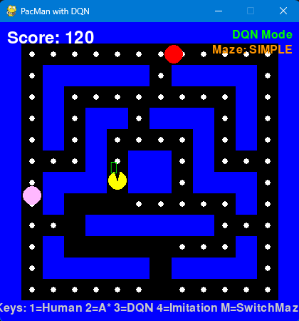

# PACMAN-RL-VS-BC

A Pacman game implementation that compares Reinforcement Learning (DQN) with Behavioural Cloning (Imitation Learning) approaches for game AI.

---

## 🔍 Project Origin & Modifications

This project is **based on the original implementation by [Jmansford](https://github.com/jmansford)**.  
Building upon his foundation, **additional features and improvements** were implemented to enhance both the gameplay and reinforcement learning experiments.

### 🧠 New Features Added
1. **Accelerate Mode** – Allows Pacman or ghosts to temporarily move faster.  
2. **Freeze Mode** – Temporarily freezes ghost movement for strategic advantage.  
3. **Invisible Mode** – Makes Pacman invisible to ghosts, testing AI perception and robustness.  
4. **Completed Reinforcement Learning (RL) training** – Fully trained DQN agents and tuned reward shaping mechanisms for improved performance.

---

## 🕹️ Project Overview

This project implements a Pacman game environment where the player (Pacman) can be controlled by either:
1. A Deep Q-Network (DQN) trained through reinforcement learning
2. A Behavioural Cloning model trained through imitation learning

The goal is to compare the performance and learning characteristics of these two different approaches to game AI.

---

## ✨ Features

- Classic Pacman gameplay with ghosts and pellets  
- Two different maze configurations (Simple and Complex)  
- DQN-based reinforcement learning implementation  
- Behavioural Cloning through imitation learning  
- **New gameplay modes: accelerate, freeze, invisible**  
- Expert demonstration recording and playback  
- Automated testing framework  
- Enhanced feature extraction for better learning  
- Visual rendering of the game state

---

## 🎮 Controls

### Game Modes
- `1`: Switch to HUMAN mode (manual control)
- `2`: Switch to A_STAR mode (automatic pathfinding)
- `3`: Switch to DQN mode (reinforcement learning)
- `4`: Switch to IMITATION mode (behavioural cloning)

### Human Mode Controls
- `↑`: Move up  
- `↓`: Move down  
- `←`: Move left  
- `→`: Move right

### New Special Abilities
- `F`: Activate **Freeze Mode** (ghosts stop moving temporarily)  
- `I`: Activate **Invisible Mode** (Pacman becomes invisible to ghosts)  
- `X`: Activate **Accelerate Mode** (Pacman moves faster)

### Game Management
- `M`: Switch between Simple and Complex maze  
- `SPACE`: Restart game (when game over or won)

### Demonstration Recording (when `RECORD_DEMONSTRATIONS = True`)
- `R`: Start recording demonstration (in HUMAN mode)
- `T`: Stop recording demonstration
- `C`: Cancel current recording
- `A`: Analyse all recorded demonstrations

---

## 🧩 Project Structure

